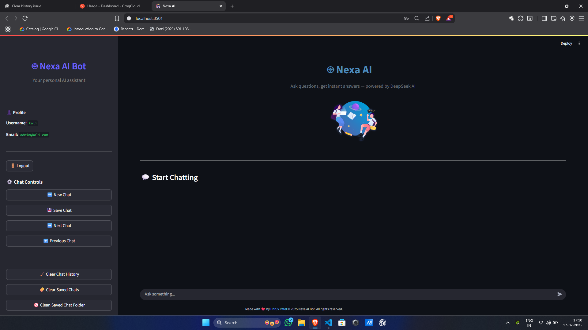
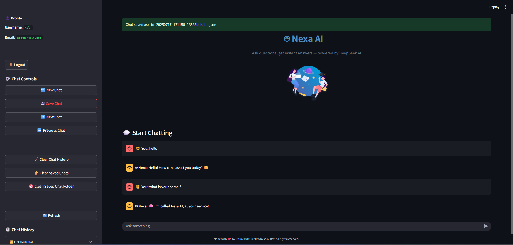
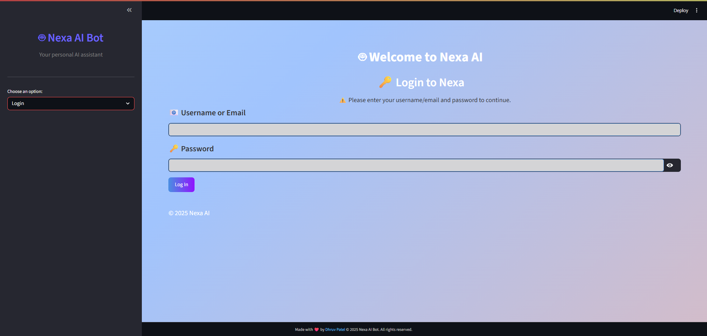
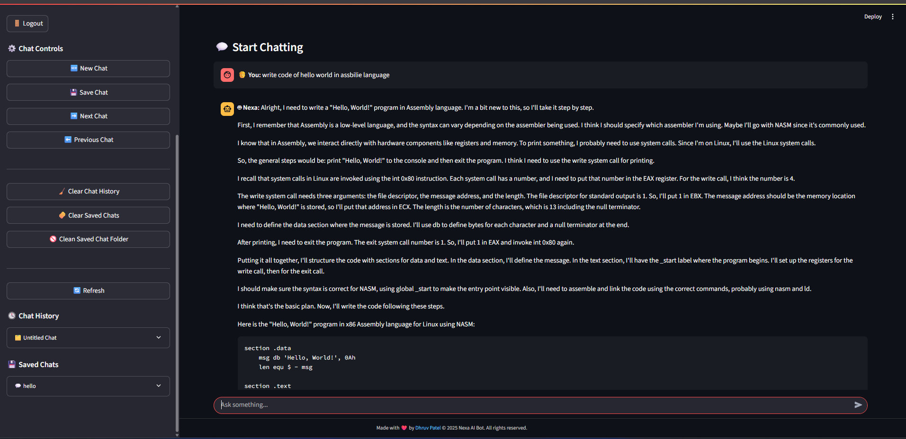
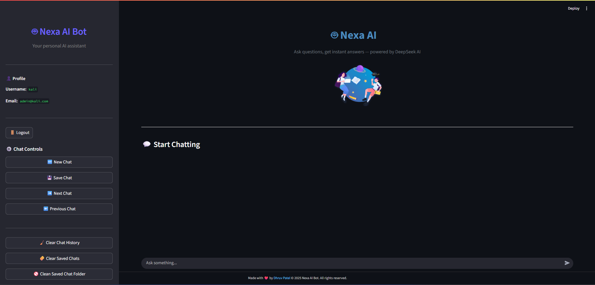
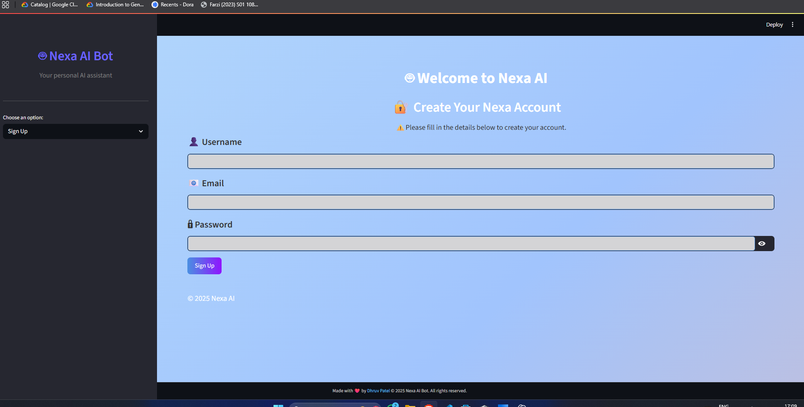
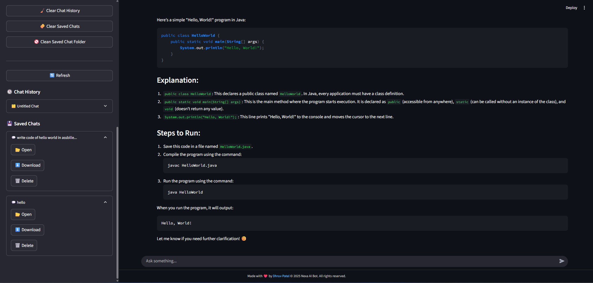
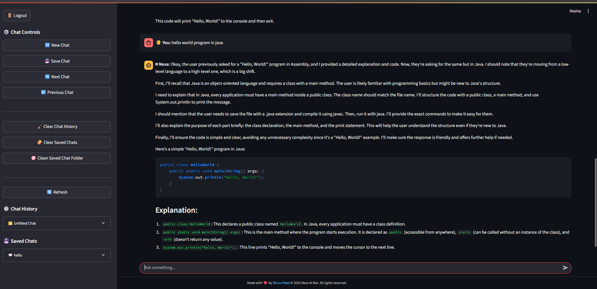

# 🤖 Nexa AI – Your Smart AI Assistant  


> 💬 A customizable, open-source conversational chatbot powered by **Streamlit + LangChain + DeepSeek/Groq**  
> 🌟 Designed for developers, learners, and AI enthusiasts with built-in memory, chat history, desi-style humor packs, and more.
> 🚀 Don’t forget to ⭐ the repo if you like this project! Help others discover Nexa AI.

---


---

# 📚 Table of Contents

- [🧠 Overview](#overview)  
- [✨ Features](#features)  
- [🛠 Tech Stack](#tech-stack)  
- [📸 Screenshots](#screenshots)  
- [🎯 Preview](#preview)  
- [📁 Project Structure](#project-structure)  
- [💻 Installation](#installation)  
  - [🔐 API Setup](#api-setup)  
  - [▶️ Run the App](#run-the-app)  
- [🧪 Usage](#usage)  
- [📄 License](#license)  
- [🙌 Contributing](#contributing)  
- [📬 Contact](#contact)

---

# 🧠 Overview

**Nexa AI** is a smart and interactive chatbot built with the latest LLMs and an intuitive UI using Streamlit. Whether you're a developer experimenting with LangChain or a student exploring AI, Nexa gives you flexibility, fun, and functionality.

---

# ✨ Features

✅ Conversational memory and smart history  
✅ Support for **DeepSeek**, **Groq** APIs  
✅ Shayari, Gujarati Jokes, Motivational & Chanakya Quotes  
✅ Animated sidebar with Lottie integrations  
✅ Save, download, and manage chats  
✅ `.env` support for secure API key usage  
✅ Clean, fast UI with emoji flavor

---

# 🛠 Tech Stack

- **Python 3.9+** – Backend logic  
- **Streamlit** – Web UI framework  
- **LangChain** – Language model orchestration  
- **DeepSeek/Groq** – LLMs for AI intelligence  
- **Lottie Files** – Animations  
- **dotenv** – API key management

---

# 📸 Screenshots

| Home UI               | Saved Chat Panel       |
|-----------------------|------------------------|
|  |  |

| Login Page            | Chat Output Example    |
|------------------------|------------------------|
|  |  |

---

# 🎯 Preview

| Welcome Animation | Sign-Up UI |
|-------------------|------------|
|  |  | 

|Download Chat | Java Query Response |
|----------------|----------------------|
| |  |


# 📺 Demo Video
<a href="https://youtu.be/your-demo-link" target="_blank" style="padding:10px 16px;background:#4CAF50;color:white;border-radius:4px;text-decoration:none;font-weight:bold;">
▶️ Watch Demo
</a>

---

# 📁 Project Structure

```bash
Ai-bot/
├── assets/
│   ├── lottie/welcome.json     # Animation
│   ├── auth.py                 # Login/session logic
│   ├── bot.py                  # Core chat interface
│   ├── custom_responses.py     # Shayari/Jokes/Quotes
│   └── sidebar.py              # Sidebar features
|
├── preview/                    # Preview images
│   ├── main.png
│   ├── login.png
│   ├── saved_chat.png
│   └── coding.png
├── .env                        # 🔐 Place your API Keys
├── .gitignore
├── LICENSE                     # MIT Licenses
├── main.py                     # Main entry to run app
├── requirements.txt            # dependencies
└── README.md
````

---

# 💻 Installation

## 🔵 Windows

### ✅ Step 1: Clone the repository
```
git clone https://github.com/dhruvpatel16120/AI-bot.git
cd AI-bot
```
### ✅ Step 2: Create & activate virtual environment
```
python -m venv venv
venv\Scripts\activate
```
### ✅ Step 3: Install dependencies
```
pip install -r requirements.txt
```

## 🟢 Linux / macOS

### ✅ Step 1: Clone the repository
```
git clone https://github.com/dhruvpatel16120/AI-bot.git
cd AI-bot
```
### ✅ Step 2: Create & activate virtual environment
```
python3 -m venv venv
source venv/bin/activate
```
## ✅ Step 3: Install dependencies
```
pip install -r requirements.txt
```

---

## 🔐 API Setup

>Get your API Key from [https://console.groq.com/keys](https://console.groq.com/keys) or other LLM providers.
+ ⚠️ Create a `.env` file in the root directory:

```env
API_KEY=your_api_key_here
```

---

### ▶️ Run the App
```bash
streamlit run main.py
```

Then open your browser:
[http://localhost:8501](http://localhost:8501)

---

# 🧪 Usage

* Use sidebar to navigate history and saved chats
* Add/delete chat history
* Switch to Shayari or Joke mode from `custom_responses.py`
* Save and download your chats
* Use “Clear” to reset memory

---

# 📄 License

This project is licensed under the **MIT License**.
See the [LICENSE](LICENSE) file for full details.

---

# 🙌 Contributing

We welcome all contributions, big or small.


### 👇 How to Start

1. Fork this repository 🍴
2. Create a new branch

   ```bash
   git checkout -b feature/amazing-feature
   ```
3. Make your changes 🚀
4. Commit your work

   ```bash
   git commit -m "Added an amazing feature"
   ```
5. Push and open a PR

   ```bash
   git push origin feature/amazing-feature
   ```

### ✅ Contribution Tips

* Write clean, readable code
* Add helpful commit messages
* Include screenshots/GIFs if adding UI features
* Keep the README up to date with your change

💖 Thanks to all amazing contributors!

---

# 📬 Contact

Made with ❤️ by [@dhruvpatel16120](https://github.com/dhruvpatel16120)
Have suggestions or issues? Open an [issue](https://github.com/dhruvpatel16120/AI-bot/issues) or email: **[dhruvpatel16120@gmail.com](mailto:dhruvpatel16120@gmail.com)**

---

